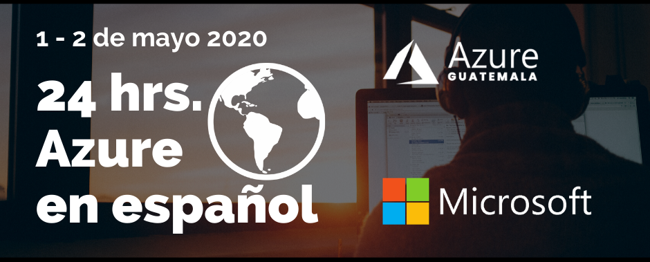

# Acerca del Evento

Este evento online gratuito cuenta con la participacion de speakers de diferentes puntos de Latinoamerica, es una inicitiva de la comunidad [Azure Guatemala](https://www.meetup.com/es-ES/Azure-Guatemala/) y el objetivo es poder compartir con toda la comunidad hispano hablante contenido en español acerca de Azure y todas las tecnologías, ecosistemas y plataformas que lo rodean.

Tendremos 24 charlas diferentes durante 24 horas dividas en 12 horas cada día.

## Fecha e informacion
El evento se llevará a cabo durante 2 dias:
- Dia 1: Viernes 1 de mayo de 2020, de 8:00 am a 7:00 pm (GMT-6)
- Dia 2: Viernes 2 de mayo de 2020, de 8:00 am a 7:00 pm (GMT-6)

Para registrarte y obtener informacion para conectarte al evento puedes acudir a este [enlace](https://www.meetup.com/es-ES/Azure-Guatemala/events/269998337/).

Aca puedes ver la [Agenda](Agenda.md).

Utilizaremos Microsoft Teams para transmitir cada charla.

[Enlaces de sesiones del viernes](EnlacesViernes.md)

[Enlaces de sesiones del sabado](EnlacesSabado.md)

# Contacto
Siguenos en nuestras redes sociales para enterarte de mas eventos:
- [Facebook](https://www.facebook.com/azuregt) 
- [Meetup](https://www.meetup.com/es-ES/Azure-Guatemala/)